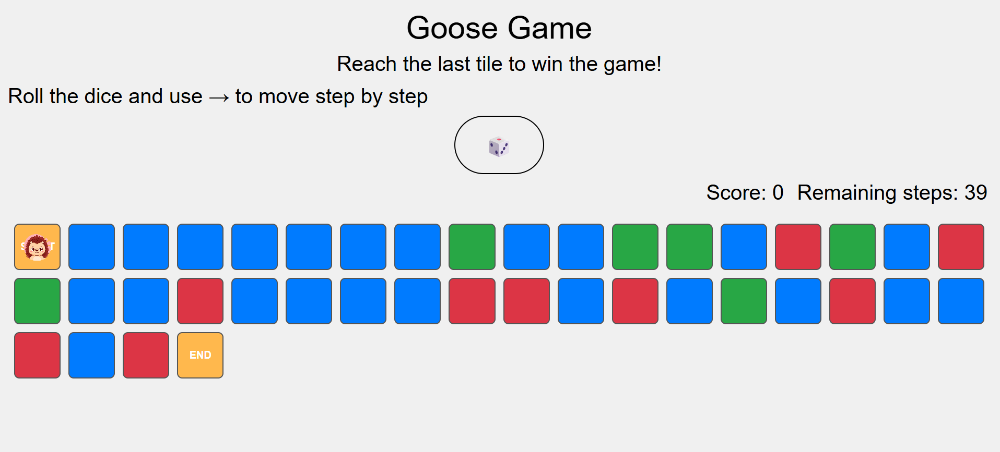
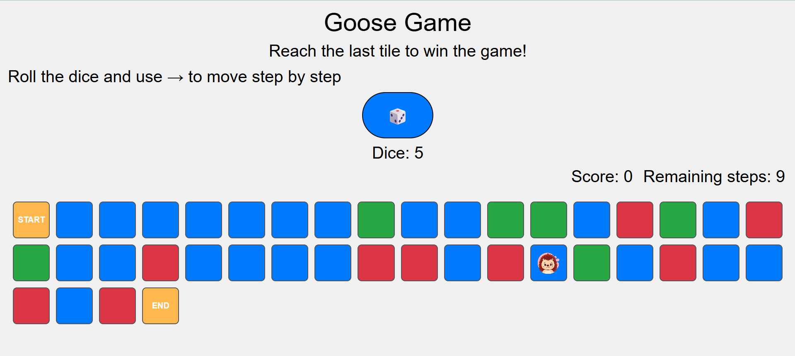
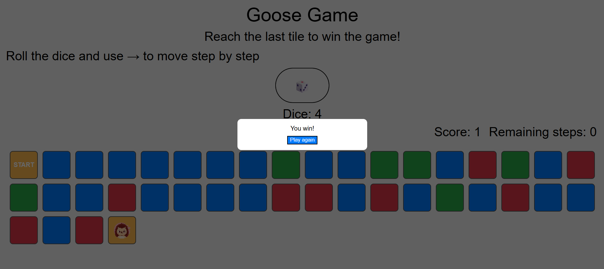

# Assignment 02

## Brief

Choose a “mini-game” to rebuild with HTML, CSS and JavaScript. The requirements are:

- The webpage should be responsive
- Choose an avatar at the beginning of the game
- Keep track of the score of the player
- Use the keyboard to control the game (indicate what are the controls in the page). You can also use buttons (mouse), but also keyboard.
- Use some multimedia files (audio, video, …)
- Implement an “automatic restart” in the game (that is not done via the refresh of the page)

## Screenshots

## Short project description 

The project is a sort of goose game where the player selects an avatar, rolls a dice and moves along a 40-tile path containing bonus, malus and neutral cells. The goal is to reach the final tile. The game includes sound effects, score tracking and interactive pop-up feedback.

## Block diagram

## List function

### newGame()

- Parameters: none
- Return: none
- Description:
Initializes a new game: resets player position, dice moves and tiles array. Generates the full 40-tile path including start, end, bonus, malus and neutral tiles. Updates the score and places the avatar on the first tile.

### movePlayer()

- Parameters: none
- Return: none
- Description:
Handles each single player movement after a dice roll. Decrements remaining dice moves, updates the player position, triggers win conditions, and calls updateVisualPlayer() to refresh the avatar on the board.

### updateVisualPlayer(newPlayerPos, type)

- Parameters: newPlayerPos and type 
- Return: none
- Description:
Updates the visual position of the avatar on the board. Removes old player markers, applies the avatar image, updates remaining steps, handles automatic bonus/malus jumps, and triggers the win sequence when reaching the final tile.

### showPopup(msg)

- Parameters: msg 
- Return: none
- Description:
Opens the popup overlay and shows a message to the player (e.g., “You win!”).

### Event Listener: Avatar Selection

- Parameters: event
- Return: none
- Description:
Handles avatar selection, highlights the chosen avatar, stores its image path, and enables the start button.

### Event Listener: Start Game

- Parameters: event
- Return: none
- Description:
Hides the start screen and initializes the game by calling newGame().

### Event Listener: Roll Dice

- Parameters: event
- Return: none
- Description:
Generates a random number between 1 and 6, displays the result, and stores it as remaining moves for movePlayer().

### Event Listener: Keyboard Movement

- Parameters: keyboard event
- Return: none
- Description:
Allows movement with the Right Arrow key, calling movePlayer() when available moves remain.

### Event Listener: Close Popup Button

- Parameters: event
- Return: none
- Description:
Closes the popup and immediately starts a new game by calling newGame().

## Content and data sources 
 [Win_audio](assets/sound/win.mp3)

 [Avatar_1](assets/img/Avatar1.png)

 [Avatar_2](assets/img/Avatar2.png)

 [Avatar_3](assets/img/Avatar3.png)

 [Avatar_4](assets/img/Avatar4.png)