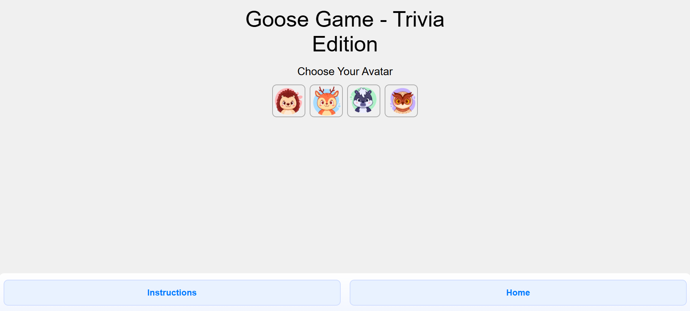
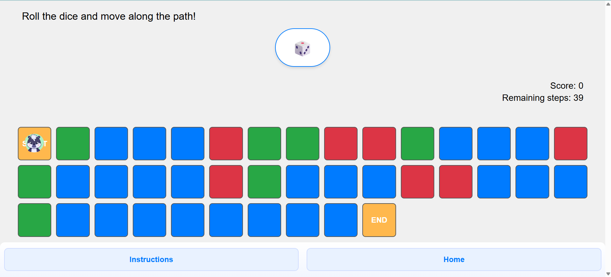
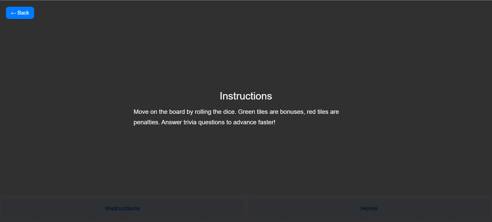
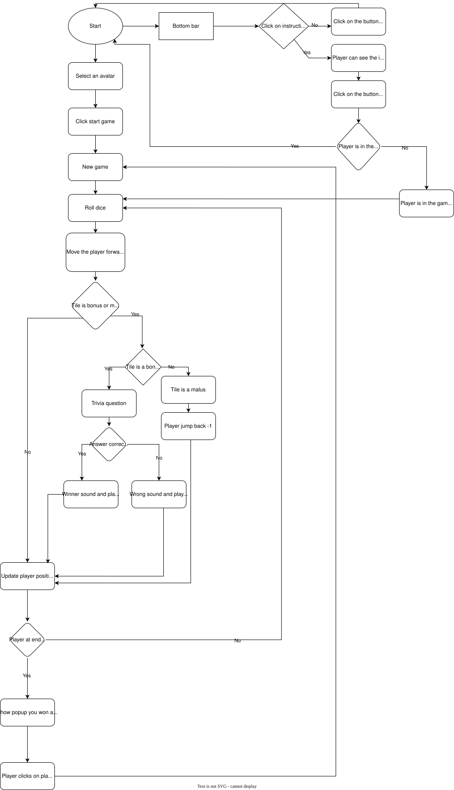

# Assignment 03

## Brief

Upgrade the **Assignment 02** by adding the use of data coming from an external web API. For example, fetch contents (audio, images, video, text, metadata) from online archives, AI generated contents (chatGPT API), data (weather, realtime traffic data, environmental data).

Have a look at the lesson about the API:

[https://wind-submarine-3d4.notion.site/Lesson-5-200d516637bc811aba69e13b0ffe438f?pvs=74](https://www.notion.so/Lesson-5-200d516637bc811aba69e13b0ffe438f?pvs=21)

The application **must** have those requirements:

- The webpage is responsive
- Use a web API (you choose which one best fists for your project) to load the data and display them in the webpage
- At least one multimedia file (for user feedback interactions, or content itself)
- Develop a navigation system that allows the user to navigate different sections with related content and functionalities

## Screenshots

## Short project description 
It's a goose game where the player moves along a path of tiles by rolling a dice. The path includes normal, bonus, and malus tiles. Landing on a bonus tile triggers a trivia quiz question: if answered correctly, the player moves forward one step; if answered incorrectly, the player stays in place. Malus tiles make the player move backward. The goal is to reach the final tile, accumulate points, and complete the path.

## Block diagram

## List function
- newGame()
    - Parameters: None
    - Returns: void
    - Description: Initializes a new game. Resets the player position, dice moves, tiles array, and locked state. Clears the path container and populates it with PATH_TILES tiles. Randomly assigns tile types (normal, bonus, malus) except for the start and end tiles. Updates the visual position of the player at the starting tile.

- movePlayer()
    - Parameters: None
    - Returns: void
    - Description: Moves the player one step forward on the path if dice moves are available and the game is not locked. Updates the player’s position, applies tile type effects (bonus, malus), and triggers a win state if the player reaches the last tile. Calls updateVisualPlayer() to update the UI.

- updateVisualPlayer(newPlayerPos, type)
    - Parameters: newPlayerPos and type
    - Returns: void
    - Description: Updates the player’s avatar on the path visually. Highlights the current tile, updates remaining steps, handles malus effects (moving back one tile with delay), and triggers bonus trivia questions for bonus tiles. Locks movement when necessary.

- fetchTrivia()
    - Parameters: None
    - Returns: void
    - Description: Fetches a trivia question from the Trivia API when the player lands on a bonus tile. Displays the question in a popup, generates answer buttons, and handles user interactions. Updates the player’s position forward if the correct answer is selected or shows the correct answer if the player answers incorrectly. Unlocks the game after processing the question.

- handleAnswer(answer, correctAnswer) (defined inside fetchTrivia)
    - Parameters: answer and correctAnswer 
    - Returns: void
    - Description: Processes the user’s answer. Plays sounds for correct or wrong answers, updates the player’s position for correct answers, updates the score if the game is won, hides the popup, and unlocks the game. Temporarily disables all answer buttons to prevent multiple clicks.

- showPopup(msg)
    - Parameters: msg
    - Returns: void
    - Description: Displays the win popup with the provided message and makes it visible on the screen.

- Avatar selection
    - Parameters: None (event listener callback)
    - Returns: void
    - Description: Highlights the selected avatar and displays the start button.

- Start game button
    - Parameters: None (event listener callback)
    - Returns: void
    - Description: Hides the start screen, shows the game screen, displays instructions, and calls newGame().

- Bottom bar navigation (btnInstructions, btnHome, backBtn)
    - Parameters: None (event listener callback)
    - Returns: void
    - Description: Handles navigation between start, game, and instructions screens. Remembers the last screen to return to it after closing instructions.

- Dice roll button (roll-btn)
    - Parameters: None (event listener callback)
    - Returns: void
    - Description: Rolls the dice (random number between 1 and 6) and updates the dice result display.

- Keyboard movement
    - Parameters: e 
    - Returns: void
    - Description: Moves the player one step forward when the right arrow key is pressed.

- Close popup button (closePopup)
    - Parameters: None (event listener callback)
    - Returns: void
    - Description: Closes the win popup and starts a new game.

## Content and data sources 
 [Win_audio](assets/sound/win.mp3)

 [Correct_sound](assets/sound/correct.mp3)

 [Wrong_sound](assets/sound/wrong.mp3)

 [Avatar_1](assets/img/Avatar1.png)

 [Avatar_2](assets/img/Avatar2.png)

 [Avatar_3](assets/img/Avatar3.png)

 [Avatar_4](assets/img/Avatar4.png)

## API documentation
https://the-trivia-api.com/ 